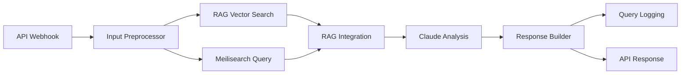

# 🏗️ Claude RAG Integration System - ワークフロー詳細解説

## 📊 **ワークフロー全体構成**



## 🔍 **各ノードの詳細解説**

### **1️⃣ API Webhook (webhook-node-001)**

**役割**: 外部からのHTTPリクエストを受信する入口点

```yaml
タイプ: n8n-nodes-base.webhook
HTTPメソッド: POST
パス: /webhook/claude-rag-api
レスポンスモード: responseNode（最後のノードからレスポンスを返す）
```

**受け付けるリクエスト形式**:
```json
{
  "question": "ユーザーからの質問",
  "search_query": "検索クエリ（オプション）",
  "search_type": "comprehensive|focused",
  "max_results": 5,
  "session_id": "セッションID"
}
```

---

### **2️⃣ Input Preprocessor (preprocessor-node-002)**

**役割**: 入力データの検証・正規化・前処理

```javascript
// 実行内容:
1. 必須フィールドの検証（question または search_query）
2. クエリの正規化（小文字変換、トリミング）
3. デフォルト値の設定
4. タイムスタンプとセッションIDの付与
```

**出力データ**:
```json
{
  "normalized_query": "正規化されたクエリ",
  "search_type": "comprehensive",
  "max_results": 5,
  "timestamp": "2025-07-13T08:00:00.000Z",
  "session_id": "session_1234567890"
}
```

---

### **3️⃣ RAG Vector Search (vector-search-003) ⚠️ 問題のノード**

**役割**: PostgreSQL + pgvectorを使用したベクトル類似検索

```yaml
タイプ: HTTPリクエスト
URL: http://replay-postgres-pgvector:15432/api/vector-search
メソッド: POST
タイムアウト: 30秒
```

**問題点**:
- ❌ **このAPIエンドポイントが存在しない**
- ❌ PostgreSQLはデータベースとして動作しているが、REST APIサーバーがない
- ❌ pgvectorは拡張機能であり、直接HTTPアクセスできない

**送信しようとするデータ**:
```json
{
  "query": "正規化されたクエリ",
  "table": "design_embeddings",
  "embedding_field": "embedding",
  "limit": 5,
  "threshold": 0.7
}
```

---

### **4️⃣ Meilisearch Query (meilisearch-004)**

**役割**: 日本語対応の全文検索エンジンでテキスト検索

```yaml
タイプ: HTTPリクエスト
URL: http://replay-meilisearch:7700/indexes/ui_designs/search
メソッド: POST
認証: Bearer Token (Master Key)
タイムアウト: 30秒
```

**送信データ**:
```json
{
  "q": "検索クエリ",
  "limit": 5,
  "attributesToHighlight": ["title", "description", "tags", "ui_type"],
  "attributesToSearchOn": ["title", "description", "content", "tags"],
  "showMatchesPosition": true
}
```

**期待されるレスポンス**:
```json
{
  "hits": [
    {
      "id": "1",
      "title": "ランディングページデザイン",
      "description": "効果的なコンバージョンを実現",
      "_formatted": { /* ハイライト結果 */ }
    }
  ],
  "query": "検索クエリ",
  "processingTimeMs": 15,
  "limit": 5
}
```

---

### **5️⃣ RAG Integration (integration-005)**

**役割**: 複数の検索結果を統合してClaude用のコンテキストを構築

```javascript
// 処理内容:
1. Vector検索結果とMeilisearch結果を統合
2. 関連度スコアの計算（0.1〜1.0）
3. Claude分析用のコンテキスト構築
4. 上位3件ずつの結果を抽出
```

**統合後のデータ構造**:
```json
{
  "rag_results": {
    "vector_search": {
      "results": [],
      "count": 0,
      "processing_time": 0
    },
    "text_search": {
      "hits": [...],
      "processingTimeMs": 15
    }
  },
  "claude_context": {
    "search_query": "正規化クエリ",
    "vector_results": [],
    "text_results": [上位3件],
    "metadata": {
      "total_sources": 5,
      "relevance_score": 0.5
    }
  }
}
```

---

### **6️⃣ Claude Analysis (claude-api-006)**

**役割**: Claude 3.5 Sonnetを使用してAI分析・回答生成

```yaml
タイプ: HTTPリクエスト
URL: https://api.anthropic.com/v1/messages
モデル: claude-3-5-sonnet-20241022
最大トークン: 3000
温度: 0.3（一貫性重視）
タイムアウト: 60秒
```

**プロンプト構造**:
```text
あなたはUI/UXデザインの専門家です。以下の検索結果を参考にして、
ユーザーの質問に専門的で実用的な回答をしてください。

## 検索結果
- ベクター検索結果
- テキスト検索結果
- メタデータ

## ユーザーの質問
[質問内容]

## 回答指針
1. 検索結果の具体的参照
2. 実践的アドバイス
3. 具体例・数値の提示
4. 日本語での分かりやすい説明
5. 信頼性の高い情報源
```

---

### **7️⃣ Response Builder (response-builder-007)**

**役割**: 最終的なAPIレスポンスの構築

```javascript
// 処理内容:
1. Claudeレスポンスの解析
2. 処理時間の計算
3. 統合レスポンスの構築
4. パフォーマンスメトリクスの追加
```

**最終レスポンス形式**:
```json
{
  "success": true,
  "timestamp": "2025-07-13T08:00:00.000Z",
  "session_id": "session_123",
  "query": {
    "original": "元の質問",
    "normalized": "正規化されたクエリ",
    "type": "comprehensive"
  },
  "response": {
    "content": "Claudeの回答内容",
    "model": "claude-3-5-sonnet-20241022",
    "confidence": 0.85
  },
  "sources": {
    "vector_search": { "count": 0, "results": [] },
    "text_search": { "count": 5, "results": [...] },
    "total_sources": 5
  },
  "performance": {
    "total_processing_time_ms": 2500,
    "vector_search_time_ms": 0,
    "text_search_time_ms": 15,
    "claude_response_time_ms": 2000
  },
  "metadata": {
    "workflow_version": "1.0.0",
    "api_version": "v1",
    "features_used": ["rag_vector_search", "meilisearch", "claude_analysis"]
  }
}
```

---

### **8️⃣ Query Logging (logging-008)**

**役割**: クエリログをPostgreSQLに保存（非同期・エラー許容）

```yaml
タイプ: HTTPリクエスト
URL: http://replay-postgres-pgvector:15432/api/query-logs
メソッド: POST
オプション: continueOnFail: true（エラーでも続行）
```

**ログデータ**:
```json
{
  "session_id": "セッションID",
  "query": "元のクエリ",
  "response_length": 1500,
  "sources_count": 5,
  "processing_time_ms": 2500,
  "confidence_score": 0.85
}
```

---

### **9️⃣ API Response (webhook-response-009)**

**役割**: 最終的なJSONレスポンスをクライアントに返却

```yaml
タイプ: respondToWebhook
レスポンス形式: JSON
文字エンコーディング: UTF-8
```

**レスポンスヘッダー**:
```http
Content-Type: application/json; charset=utf-8
X-Processing-Time: 2500ms
X-Sources-Count: 5
X-Confidence-Score: 0.85
```

---

## ⚠️ **現在の問題点と解決策**

### **問題点**

1. **PostgreSQL API不在**
   - Vector検索ノードが存在しないAPIを呼び出し
   - Query LoggingノードもAPIエラー

2. **依存関係の失敗**
   - 1つのノードが失敗すると全体が停止
   - エラーハンドリングが不十分

### **推奨される解決策**

#### **Option 1: PostgreSQL APIサーバーの実装**
```yaml
必要なコンポーネント:
- Express/FastAPIサーバー
- pgvector拡張を使用したベクトル検索API
- ログ記録API
```

#### **Option 2: ワークフローの簡略化（推奨）**
```yaml
短期的解決:
1. Vector検索ノードを一時的に無効化
2. Query Loggingを無効化またはファイル出力に変更
3. MeilisearchとClaudeのみで動作確認
```

#### **Option 3: 直接データベース接続**
```yaml
n8nのPostgreSQLノードを使用:
- HTTP APIではなく直接SQL実行
- pgvectorクエリの直接実行
```

---

## 📈 **パフォーマンス最適化のポイント**

1. **並列処理**
   - Vector検索とMeilisearch検索は並列実行
   - 最も遅い処理がボトルネック

2. **タイムアウト設定**
   - 各HTTPリクエスト: 30秒
   - Claude API: 60秒
   - 全体のワークフロー: 約2分

3. **エラーハンドリング**
   - Query Loggingは`continueOnFail`で非同期
   - 重要でない処理の失敗を許容

---

## 🎯 **このワークフローの目的**

1. **ハイブリッド検索**
   - 意味的類似性（ベクトル検索）
   - キーワードマッチング（全文検索）

2. **AI強化回答**
   - 検索結果を基にした専門的回答
   - コンテキストを考慮した説明

3. **パフォーマンス監視**
   - 各処理の実行時間測定
   - 検索精度の追跡

4. **スケーラビリティ**
   - 非同期処理による高速化
   - ログによる使用状況分析